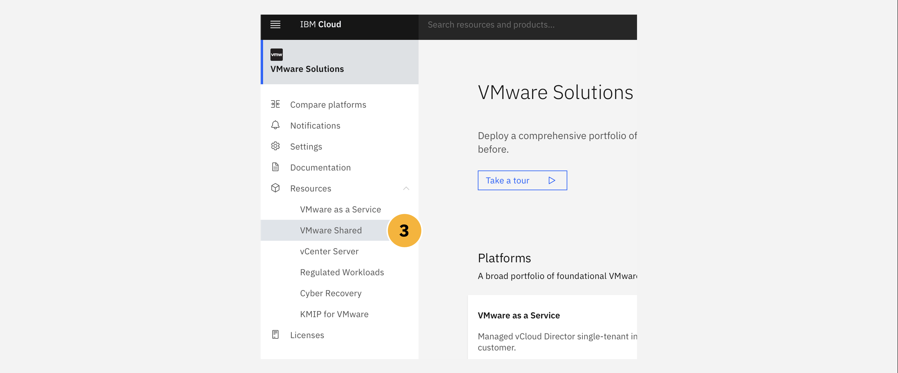
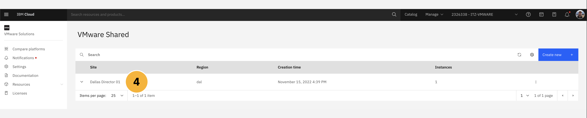
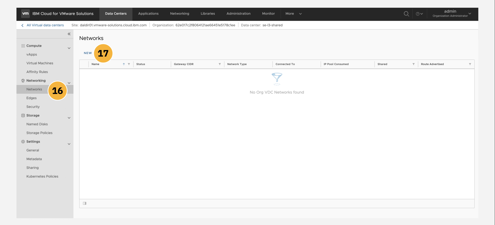
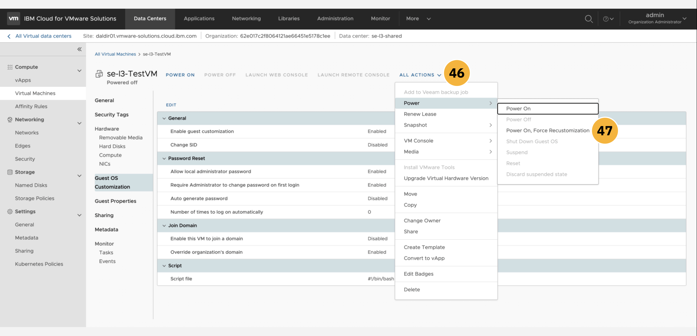
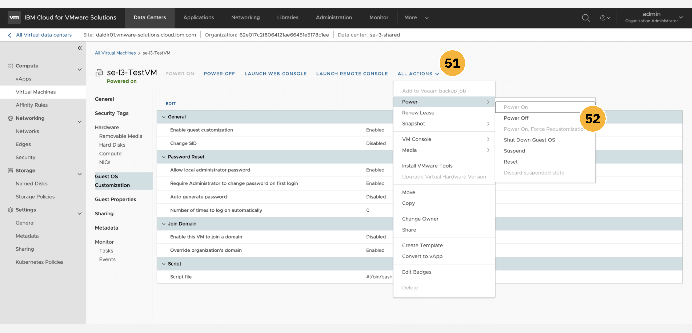

The following module guides business partners and IBM sellers through the myriad of features and management tools available from within the VMware Shared platform dashboard on IBM Cloud. You will explore various elements of the management panels and tooling, including: data centers, applications, virtual machines, networking, libraries, platform administration, and system monitoring.

VMWare Solutions, including the **Shared** plan and other tiers, are accessible through the <a href="https://cloud.ibm.com/vmware" target="_blank">VMware portal on IBM Cloud</a>.

#
# Accessing the vCloud Director console

1. Ensure that your IBM Cloud account is using the ```ITZ-VMWARE``` account that you were invited to as part of the prerequisite setup for this hands-on material. From the IBM Cloud dashboard, click the **VMware** tab from the left-hand navigation menu, or alternatively search for ```VMware Solutions``` in the search bar.

!!! warning "WARNING"
    If you continue with the following instructions using your _personal_ IBM Cloud account, there is a risk that your account (and credit card associated with that personal account) will be billed for provisioning a VMware Solutions deployment. To avoid any unwanted charges, ensure that your account is switched to ```ITZ-VMWARE``` before continuing.

2. Drill down into the **Resources** tab within the left-hand navigation menu.


3. From the variety of VMware Solutions plans available, click on the **VMware Shared** tab.



An instance of VMware Shared should already be set up, having completed the <a href="https://ibm.github.io/SalesEnablement-VMware-L3/Shared/Provisioning/" target="_blank">Provisioning</a> section earlier.

4. Locate the instance— ```Dallas Director 01``` in the example screenshot below, although the naming of your instance may differ —and click the **name** of the instance to pull open a Summary page.



The browser will load a Summary panel for the VMware Shared instance, supplying details on access controls for your platform, virtual data centers associated with the deployment, and additional services that can be used in conjunction with the platform.

5. Before you can connect to the VMware Shared instance, you need to set an administrative password for the **vCloud Director console**. Do so by clicking the **Reset site admin password** button as shown.


A dialogue window will open, asking you to confirm an administrative password reset for the instance. Confirm the selection and wait for the reset to complete. The **User name** will always be set to ```admin``` by default. The **Password** will be uniquely generated each time a reset is conducted.

6. Click the "eyeball" icon to view the password and the "box" icon to copy the password to your machine's clipboard. **Record** both of these values to a notepad — you will need to reference these later for connecting to the vCloud Director Console. Click the **Close** button to continue.


7. Back on the Summary page, locate the **vCloud Director console** button near the top-right of the screen. Before resetting the admin password, this button would have been greyed out and inaccessible. With the password reset complete, the button is now active — click it to continue to the console login page.


8. A new tab or window will open, prompting you to log in to the vCloud Director console. Use the ```admin``` and ```password``` fields recorded in **Step 6** to log in to the console.


Having been successfully authenticated, your browser will redirect and open to the **vCloud Director console**. From this page, you will be able to access many of the administrative functions for your VMware Shared platform (restricted from full administrative purposes for the purposes of this hands-on, shared environment). By default, the console will load to the **Data Centers** tab. Here you can inspect details on the virtual data center supporting your environment, which in the case of the example screenshot below is the ```bienko-vdc``` environment which was set up during the <a href="https://ibm.github.io/SalesEnablement-VMware-L3/Shared/Provisioning/" target="_blank">Provisioning</a> section earlier. A summary of the VDC's CPU, memory, and storage utilization is provided at the bottom of the page.

9. Let's explore other elements of the vCloud Director console. From the navigation menu along the top of the console dashboard, click the **Applications** tab.


#
# Managing Applications and Virtual Machines

The console's **Applications** dashboard allows for the centralized management and deployment of all applications— which are categorized as either *virtual machines* or *virtual applications* —within the VMware Shared environment. A virtualized application, or *vApp*, consists of one or more virtual machines (VMs) that communicate over the Shared plan's network, makes use of the Shared plan's resources, or invokes services that the Shared plan supports. A single vApp can consist of one, or multiple, VMs as part of its backbone.

10. Let's try drafting a new virtualized application from scratch. Do so by clicking the **New vApp** button from the menu at the bottom of the page.


11. The first order of business is selecting which Virtual Data Center that the virtual application will be assigned to. By default, you should see the VDC environment that was created earlier (```bienko-vdc``` in the example screenshot below).

12. Click **Next** to continue.


13. The new vApp will require a **Name** (```vAppSample```) and a **Description** (```Demonstration purposes only.```). The **Power On** toggle can be left *off* for now, as we will not be deploying this example vApp to a live state.

14. No virtual machines currently exist within the VMware Shared VDC environment, but if they did they would be listed within the table presented on this page. Instead, you will need to craft your own. Click the **Add Virtual Machine** button below the table to define a new VM.


15. A new configuration window will open. Provide a **Name** (```BienkoVM```) and **Computer Name** (```BienkoVM```), as well as an optional **Description**, for the new VM.

16. The VM can either be crafted from scratch (```New```) or from a pre-designed template (```From Template```). One of the advantages of the VMware Shared plan on IBM Cloud is the wealth of templates available out of the box with the offering. Select the **From Template** option and then scroll through the template repository.

17. We recommend selecting the ```vm-redhat8``` template, which corresponds to the Red Hat 8 official template (RHEL8), for the purposes of this demonstration — although you are free to choose any of your liking. Scroll down the page to reveal more configuration options.


18. **Storage** for the VM is the next consideration. As described earlier in the Provisioning module, there are a variety of storage options available for virtual machines and virtual applications deployed within the VMware Shared environment. Each storage tier conveys different levels of throughput (IOPs) and levels of isolation (multi-tenant versus single-tenant), with differing levels of billable rates and charges associated with each tier. For our purposes, we recommend the ```Standard (VDC Default)``` tier of **Storage Policy**.

19. **Compute** is dictated by the VDC sizing configuration that was set during the Provisioning module. The resources available to the VM we are defining here are restricted by the hardware configurations assigned to the VDC (```bienko-vdc```) when it was deployed earlier.

20. **NICs**, or Network Interface Cards, provides the network interface needed by the virtual machine for communication with the public internet, IBM Cloud, and on-premises resources. The *Primary NIC* will have been configured by default and no adjustments are required at this time.

21. When satisfied, click the **OK** button at the bottom of the panel to return to the vApp definition page.



#
# Creating vApps from a Template


#
# Managing Networks








#
# Managing Libraries


#
# Administration and User Definitions


# System Monitoring


