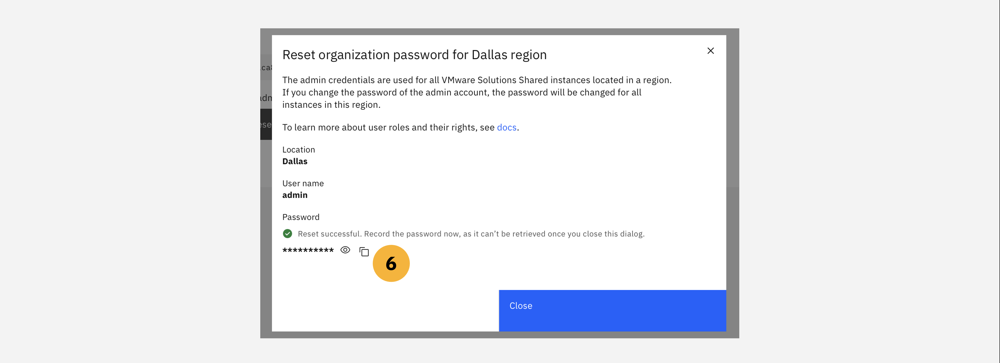
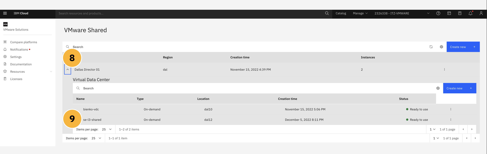
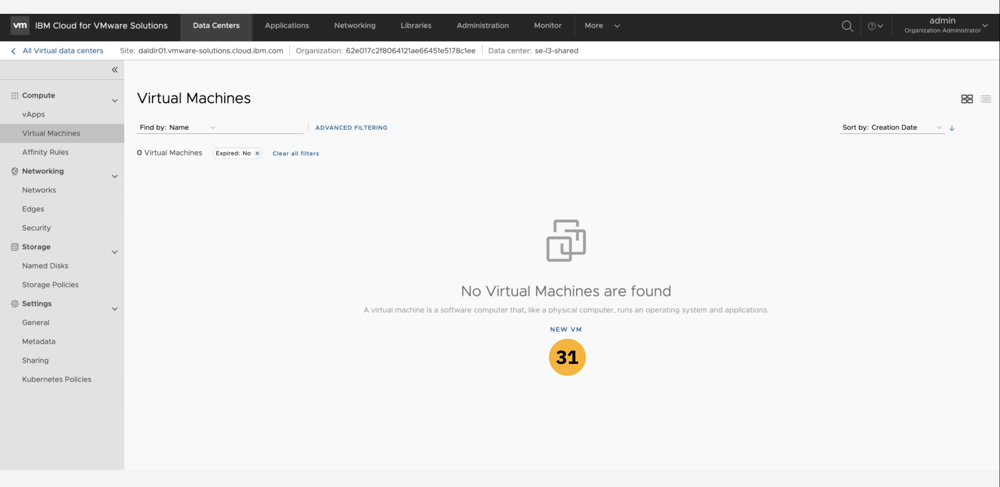
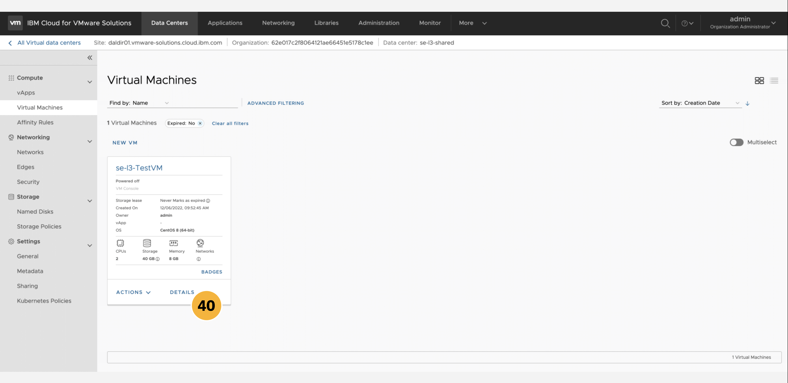
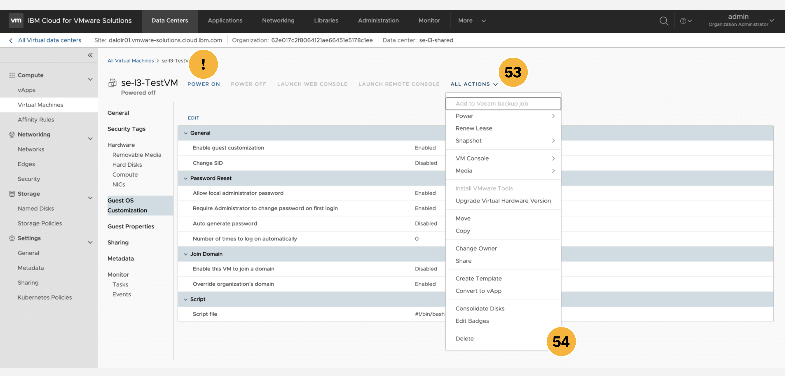

!!! tip "WAYS TO WATCH"
    In addition to the embedded video, IBMers and Business Partners can also <a href="https://ibm.seismic.com/Link/Content/DCFGW2RT6jVGm82VTDMJ6TdDJC4V" target="_blank">download the recording from Seismic</a>.

The following module guides business partners and IBM sellers through the myriad of features and management tools available from within the VMware Shared instance dashboard on IBM Cloud. You will explore various elements of the management panels and tooling, including: data centers, applications, virtual machines, networking, libraries, administration, and system monitoring.

#
# Click-Thru Demonstration
-----------------------------

**——————— UPDATE THE TEXT BELOW**

**Click-thru demo:** <a href="https://ibm.github.io/SalesEnablement-VMware-L3/includes/Shared-Managing-VCD/index.html" target ="_blank">Managing an instance of IBM Cloud VMware Solutions Shared</a>.

Use the click-thru demonstration linked above to practice managing an instance of VMware Shared. The fields that require a text entry (e.g. service name) are pre-populated in the click-thru demonstration. Open the link and then click the play button  to begin the demonstration.

!!! note "NAVIGATION"
    Not sure where to click or what to do next? Simply click anywhere on the screen within the click-thru demo page and the spot to interact with next will be highlighted. Step-by-step instructions on how to navigate the demo, and repeat the demonstration again in front of clients, are provided in the write-up below.

**——————— UPDATE THE TEXT ABOVE**


#
# Step-By-Step Instructions
----------------------

VMWare Solutions, including the **Shared** plan and other tiers, are accessible through the <a href="https://cloud.ibm.com/vmware" target="_blank">VMware portal on IBM Cloud</a>. Be aware that if you provision a live VMware Shared instance using your *personal* IBM Cloud account, then your account (and credit card associated with that personal account) will be billed for the deployment.

1. From the IBM Cloud dashboard, click the **VMware** tab from the left-hand navigation menu, or alternatively search for ```VMware Solutions``` in the search bar.

2. Drill down into the **Resources** tab within the left-hand navigation menu.


3. From the variety of VMware Solutions plans available, click on the **VMware Shared** tab.


An instance of VMware Shared should already be set up, having completed the <a href="https://ibm.github.io/SalesEnablement-VMware-L3/Shared/Provisioning/" target="_blank">Provisioning</a> section earlier.

4. Locate the instance— ```Dallas Director 01``` in the example screenshot below, although the naming of your instance may differ —and click the **name** of the instance to pull open a Summary page.


The browser will load a Summary panel for the VMware Shared instance, supplying details on access controls for your instance, virtual data centers associated with the deployment, and additional services that can be used in conjunction with the instance.

5. Before you can connect to the VMware Shared instance, you need to set an administrative password for the **vCloud Director console**. Do so by clicking the **Reset site admin password** button as shown.


A dialogue window will open, asking you to confirm an administrative password reset for the instance. Confirm the selection and wait for the reset to complete. The **User name** will always be set to ```admin``` by default. The **Password** will be uniquely generated each time a reset is conducted.

6. Click the "eyeball" icon to view the password and the "box" icon to copy the password to your machine's clipboard. **Record** both of these values to a notepad — you will need to reference these later for connecting to the vCloud Director console. Click the **Close** button to continue.



7. Locate the **VMware Shared** navigation link near the top-left of the page. Click the URL to return to the overview page for all VMware Shared instances.


8. Just to the left of the ```Dallas Director 01``` instance is a drop-down arrow — click this arrow to expand the list of all Virtual Data Centers (VDC) belonging to that instance.

9. There may multiple VDCs belonging to the ```Dallas Director 01``` VMware Shared instance. In our example, click on the **Name** of the ```se-l3-shared``` VDC to pull open additional details.



10. Let's experiment with resizing the amount of vCPU and RAM resources assigned to the VDC. Recall earlier that it was mentioned how IBM Cloud enables scalable deployments of VMware Shared, which can be adjusted (up or down) as the resource requirements of the instance change over its lifecycle. Edit the **Resource Reservation** field by clicking the pencil icon, as shown below.


11. Adjust the **vCPU Limit** field down to ```50``` vCPU and reduce the **RAM Limit** field to ```5120``` GB.

12. Take note that the metered billing for the instance will be adjusted based on the reduced resource requirements. When satisfied, click **Modify** to confirm and implement the changes.


13. Back on the Summary page, locate the **vCloud Director console** button near the top-right of the screen. Before resetting the admin password, this button would have been greyed out and inaccessible. With the password reset complete, the button is now active (blue) — click it to continue to the console login page.


14. A new tab or window will open, prompting you to log in to the vCloud Director console. If one does not appear, check to make sure a pop-up blocker is not active. Use the ```admin``` and ```password``` fields recorded in **Step 6** to log in to the console. Click **Sign In** to continue.


After successfully authenticating, your browser will redirect to the **vCloud Director console**. From this page, you will be able to access many of the administrative functions for the VMware Shared environment (with some restrictions in place to ensure the safety and stability of the deployment). By default, the console will load to the **Data Centers** tab. Here you can inspect details on the virtual data center supporting your environment. A summary of the VDC's vCPU, memory, and storage utilization is provided at the bottom of the page.

15. Let's drill down into the ```se-l3-shared``` VDC that was re-sized earlier by clicking the tile, as shown, in the dashboard.


From this management screen, you can access information on the VMware Shared plan's available ```Networks```, ```Edge Gateways```, ```Data Center Groups```, and ```Security Tags```. By default, the ```Networks``` associated with the deployment will be displayed first — at this time, your environment should contain no defined networks.

16. Our first task will be to define **Networking** parameters for the VDC. Click the **Networks** subdirectory from the list of tabs along the left side of the interface.

17. Click the **New** button, as shown in the screenshot below, to create a new network configuration for the VDC.


A new page will load to guide you through the process of defining an organization-wide virtual data center (VDC) network. The first element to be defined is the overall **Scope** of the network.

18. The **Scope** of the network can be constrained to either an *organization-wide VDC* (providing connectivity only across the virtual machines belonging to that particular VDC), or across a *data center group* (connectivity across all VDCs belonging to that group, inclusive of all VMs belonging to those VDCs). Select the **Current Organization Virtual Data Center** option to keep networking connectivity restricted to only this singular VDC (```se-l3-shared```).

19. When satisfied, click **Next** to continue.


You must now decide the **Network Type** appropriate for this deployment. There are two options:

- *Routed*: A network type that utilizes an edge gateway to enable controlled access to networks and machines external to (outside of) the VDC.

- *Isolated*: A network type that is only accessible by the VDC (or associated VDC Groups) specified in **Step 44**, thereby providing a fully isolated environment.

20. Select the **Routed** Network Type.

21. When satisfied, click **Next** to continue.


22. Having selected the **Routed** network type in **Step 46**, which makes use of an edge gateway for regulated access to the network, we must now define an **Edge Connection** for the organization VDC. The configuration tool will automatically designate an edge connection (```edge-dal12-d625b1f2``` for the ```Dallas Director 01``` data center) with ```2``` External Networks and ```0``` Org VDC Networks.

Next, you must choose the type of Edge Connection to be applied. There are three options:

- *Internal*: For connecting to one of the edge gateway's internal interfaces. The maximum number of supported network connections is ```9```.

- *Distributed*: For connecting via fast and efficient *East-West* routing. The network will be connected to an internal interface of a distributed router that is exclusively associated with this gateway. The maximum number of supported network connections is ```400```.

- *Subinterface*: For connecting to the edge gateway's internal trunk interface. The maximum number of supported network connections is ```200```.

23. Select the **Internal** Edge Connection type. When satisfied, click **Next** to continue.


24. Provide a unique **Name** for the organization VDC network (```se-l3-network```) and optionally a basic **Description** to its purpose.

A **Gateway CIDR** must be assigned, which includes the IP address of the gateway. This value cannot be changed once assigned.

25. Assign a CIDR of ```192.168.1.1/24``` and leave the **Dual-Stack Mode** option disabled. For our purposes, the network is not to be **Shared**: therefore, leave this option disabled.

26. When satisfied, click **Next** to continue.


**Static IP Pools** must now be assigned to the Gateway CIDR assigned earlier in **Step 25**. Verify that the CIDR displayed on this panel matches the one that you designated previously. No additional modifications are required at this time.

27. When satisfied, click **Next** to continue.


**DNS**, or the Domain Name System, provides the mapping between IP addresses (such as the ones specified earlier) and the "name" address that you typically enter into a web browser (```www.google.com```, for example). A DNS relay can be enabled for the edge gateway previously configured; however, the DNS relay must be set before deployment and cannot be modified after the fact.

28. **Enable** the **Use Edge DNS** slider. The remaining fields below can remain blank. When satisfied, click **Next** to continue.


The **Ready to Complete** panel provides a full summary of your organization VDC network configurations. Here you can review the details of the network before choosing to commit to a deployment, or discard the network configuration completely.

29. Click the **Finish** button to create the network.


Your browser will automatically redirect to the **Networking** tab of the vCloud Director console. From the list of Networks, you will see the ```se-l3-network``` deploy and eventually update its status to ```Ready``` once fully initialized.

30. Click the **Virtual Machines** subdirectory from the list of tabs along the left side of the interface.


The console's **Applications** dashboard allows for the centralized management and deployment of all applications— which are categorized as either *virtual machines* or *virtual applications* —within the VMware Shared environment. A virtualized application, or *vApp*, consists of one or more virtual machines (VMs) that communicate over the Shared plan's network, making use of the Shared plan's resources, or invoking services that the Shared plan supports. A single vApp can consist of one, or multiple, VMs as part of its backbone.

31. Let's try drafting a new virtual machine from scratch. Do so by clicking the **New VM** button from the menu at the bottom of the page.



32. A new configuration window will open. Provide a **Name** (```se-l3-TestVM```) and **Computer Name** (```se-l3-testvm```), as well as an optional **Description**, for the new VM.

33. The VM can either be crafted from scratch (**New**) or from a pre-designed template (**From Template**). One of the advantages of the VMware Shared plan on IBM Cloud is the wealth of templates available out of the box with the offering. Select the **From Template** option.

34. **Disable** the **Power Off** toggle, as we do not want to initialize the VM until making additional configuration changes in a later step.

35. We recommend selecting the ```vm-centos8``` template, which corresponds to the CentOS 8 (64-Bit) official release, for the purposes of this demonstration — although you are free to choose any of your liking. Continue scrolling down the page to reveal more configuration options.


**Storage** for the VM is our next consideration. As described earlier in the Provisioning module, there are a variety of storage options available for virtual machines and virtual applications deployed within the VMware Shared environment. Each storage tier provides different levels of throughput (IOPs) and levels of isolation (multi-tenant versus single-tenant), with differing levels of billable rates and charges associated with each tier. For our purposes, we recommend the ```Standard (VDC Default)``` tier of **Storage Policy**.

**Compute** is dictated by the VDC sizing configuration that was set during the Provisioning module. The resources available to the VM we are defining here are restricted by the hardware configurations assigned to the VDC (```bienko-vdc```) when it was deployed earlier.

**NICs**, or Network Interface Cards, provide the network interface needed by the virtual machine for communication with the public internet, IBM Cloud, and on-premises resources.

36. The *Primary NIC* will have been configured by default, but additional modifications are needed before we can continue. Ensure the **Connected** field is toggled ```ON```

37. Set the **Network** field to the network configuration deployed earlier: ```se-l3-network```

38. Set the **IP Mode** to ```DHCP```

39. When satisfied, click the **OK** button at the bottom of the panel to deploy the VM (which will remain powered off for now) and return to the **Virtual Machines** overview dashboard.


40. Locate the newly-minted VM tile on the page and click the **Details** button to inspect it further.




# Left Off Here ----------


22. *(A):* A summary panel will now display outlining the full configuration of the vApp. To avoid incurring any unnecessary charges, click the **Cancel** button to return to the **Applications** tab.


62. From the list of subdirectories along the top of the screen, drill down into the **Edge Gateways** panel as shown.

63. The panel will summarize all of the Edge Gateways currently deployed on the VMware Shared instance, including the one we just created (```edge-dal10-67c6f68e```). Click the **Name** of that Edge Gateway (your name may differ from the example shown) to expand additional details about it.


Generalized information about the Edge Gateway are displayed on the details page.

64. Explore each of the subdirectories— *Services*, *Redeploy*, *Enable Distributed Routing*, *Sync Syslog*, and *Open in VDC Context* —to glimpse more of the administrative options available for your newly-created Edge Gateway and organization VDC network.

65. Information and configuration options related to **External Networks** are available from the navigation menu on the left side of the panel.




#
# Managing Applications and Virtual Machines
----------------------


13. The new vApp will require a **Name** (```vAppSample```) and a **Description** (```Demonstration purposes only```). The **Power On** toggle can be left ```OFF``` for now, as we will not be deploying this example vApp to a live state.

14. No virtual machines currently exist within the VMware Shared VDC environment, but if they did they would be listed within the table presented on this page. Instead, you will need to craft your own. Click the **Add Virtual Machine** button below the table to define a new VM.


#
# Creating vApps from a Template
----------------------

22. *(B):* An alternative to defining a vApp from scratch is to select from the pre-built catalog of vApps that are packaged with every VMware Shared deployment on IBM Cloud. To inspect the resources available, click the **Add vApp from Catalog** button at the bottom of the page.


23. A configuration window will open to configure a cataloged virtual application. First, select from the list of pre-built templates. For our demonstration purposes, we recommend selecting the ```CentOS-7-Template-Official```, but do take the time to browse the available options for yourself before continuing.

24. When satisfied with your selection, click **Next**.


25. The vApp will require a **Name** (```BienkoVAppTemplate```) and optional **Description**.

The **Runtime lease** field determines the length of time that the vApp can run within the VDC before its access to system resources is paused. The **Storage lease** field sets the time that the vApp remains available, from the moment it is stopped (when the *Runtime lease* expires). After the *Storage lease* has expired, clean-up of the vApp resources and associated data will begin automatically.

26. For our demonstration purposes, both the **Runtime lease** and **Storage lease** fields can be set to ```Never Expires```.

27. When satisfied, click **Next** to continue.


The resources to which the vApp has permitted access to are configured on the following page. As described in **Step 18**, there are a variety of **Storage Policies** available — with differing metering and pricing metrics associated with each tier.

28. For the purposes of our demonstration, configure the ```vm-centos07``` vApp to utilize the ```Standard``` **Storage Tier**.

29. **Per-Disk Storage Policies** are configured in the second table of this panel. You must **Select a VM**, which should be automatically populated to ```vm-centos07``` (or the VM naming that you specified earlier). By default, the *Storage Policy* will inherit the type of storage specified in **Step 28** (```Standard```).

30. When satisfied, click **Next** to continue.


31. The vApp's **Compute Policies** are configured next. The total number of vCPUs that the vApp can access are determined by the **Virtual CPUs** field (```2```) and the constraints on **Cores per Socket** that can be accessed per vCPU are determined by the second field (```1```). The **Number of Sockets** is fixed at ```2``` for our example.

32. The maximum amount of RAM available to the vApp is determined by the **Memory** field (```8 GB```).

33. When satisfied, click **Next** to continue.


34. The **Customize Hardware** panel will allow you to configure the hardware— storage, in our case —available to the virtual machines running as a part of this vApp. Recall that a vApp can be comprised of one, or many, virtual machines. The **Hard Disks** associated with the vApp have been configured automatically to a size of ```64GB```.

35. When satisfied, click **Next** to continue.


Via the **Configure Networking** panel, you can specify and constrain the virtual networks that VMs running within the vApp will be able to connect to. These variables can also be adjusted after the vApp has been configured and launched. The vApp (```vm-centos07```) to which these networking configurations will be applied has been selected automatically.

36. You must specify the **Network** field for this vApp: select the ```vAppNet-vro-template-network``` from the list of pre-configured networking templates.

37. When satisfied, click **Next** to continue.


38. Additional properties can be configured via the **Custom Properties** tab. Should you wish, you can assign a custom hostname for guests via the ```guest.hostname``` property for this vApp. Leave this field blank.

39. When satisfied, click **Next** to continue.


The **Ready to Complete** panel provides a full summary of your vApp (from Template) configurations. Here you can review the vApp before choosing to commit to a deployment, or discard the vApp configuration completely.

40. Click the **Cancel** button to avoid any billing charges.


The web browser will automatically be redirected back to the **Applications** tab of the vCloud Director console.

#
# Managing Networks
----------------------

41. From the dashboard of the vCloud Director console, switch to the **Networking** tab using the navigation bar along the top of the page.


#
# Additional Capabilities and Tooling
----------------------

For the purposes of this hands-on demonstration, we won't go too deeply into detail on other areas of the VMware Solutions Shared plan environment. Until live applications, virtualized machines, and a workforce of users are actively engaged with the instance, these other areas of the vCloud Director console will remain relatively quiet. However, we have included pointers below to relevant areas that may spark interest and conversations with clients. Feel free to peruse these areas and explore topics that may be pertinent to your customer engagements.

66. Using the navigation tabs along the top of the console, explore the **Libraries** tab. Here you can investigate more details on the vApp templates that were touched on earlier in this hands-on material. Users can expand the number of templates available within their own environment by importing them directly from VMware's vCenter.


67. From the **Administration** tab, a myriad of options for user management and access control are available.

68. Here, VMware Shared users with administrative privileges can create new users, groups for those users, and roles for users to be assigned to. Identity providers, policies, certificates, and other security settings can also be implemented from this page.


69. As an example, the screenshot below emulates the **Create User** panel. A user ```vAppAuthor``` is defined and an authentication password is assigned.

70. The **Roles** field determines the level of privileged access and capabilities granted to the user. An administrator responsible for creating the user will be able to select from a variety of Roles (pre-built or admin-defined), such as ```vApp Author```, that enable a user to carry out their expected job responsibilities without compromising the security of the VMware Shared instance as a whole.

71. **Quotas** can be applied to the user, limiting how many VMs (running or paused) that said user can manage within the instance.

72. Discard any changes made to the user and group definitions.


73. Lastly, from the **Monitoring** tab it is possible for administrative users to inspect running *Tasks* and *Events* across the instance.

74. Click on any of the task or event names to drill down into more granular details surrounding that item.

75. When you have completed your tour of the vCloud Director console, click the username dropdown in the top-right corner of the dashboard and **Log Out** to end your session.


At this point in time, you have successfully explored the myriad of features and management tools available from within the **VMware Shared** dashboard on IBM Cloud. You should now have greater familiarity and fluency with the various elements of the management panels and tooling, including: how to manage data centers, building applications and virtual machines through the guided web interface, establishing networking rules, and the wealth of tooling available for managing the environment once in production.

In the following chapter, you will investigate **IBM Cloud for VMware Solutions Dedicated**.
