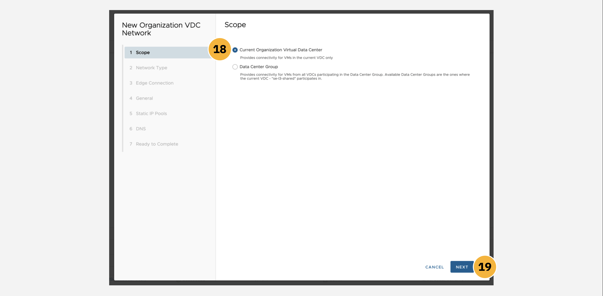
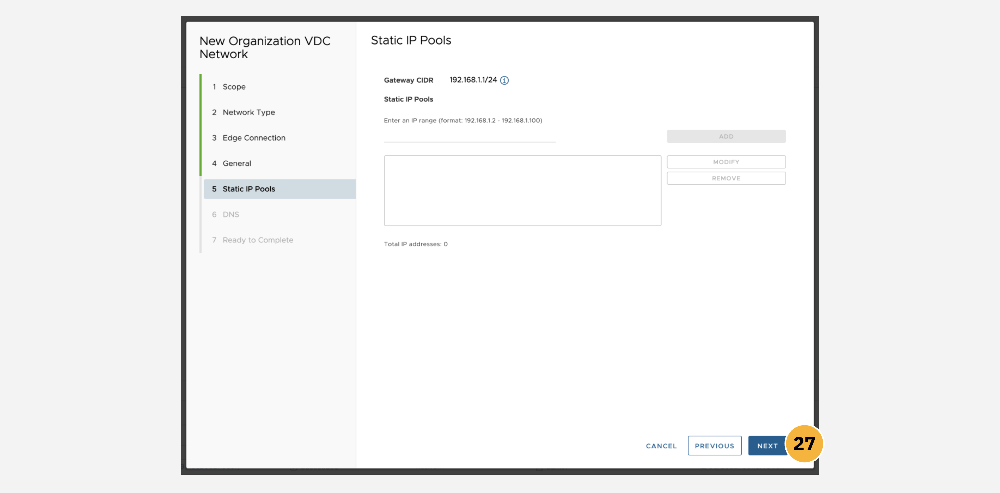
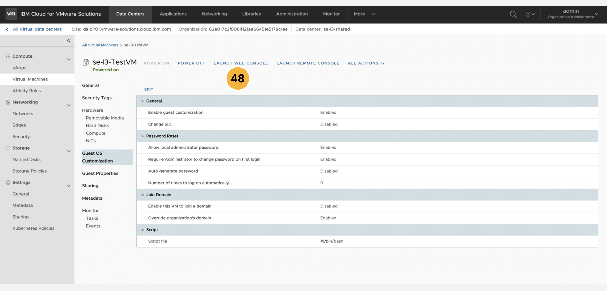
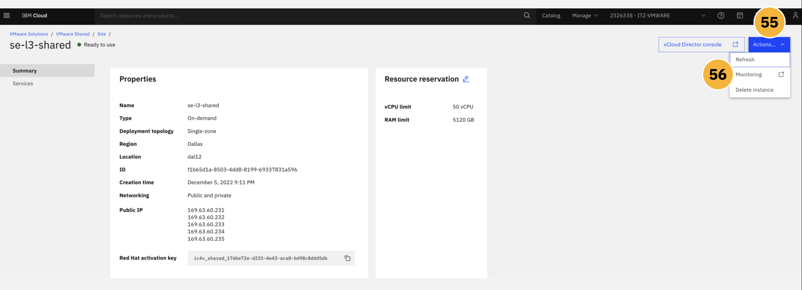
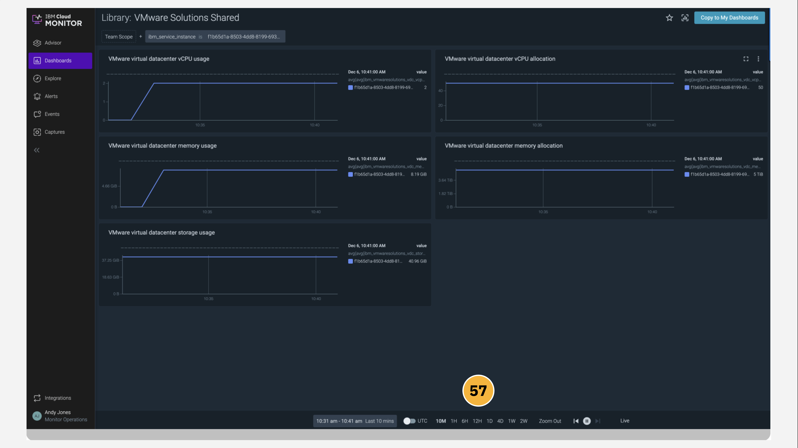

!!! warning "WORK IN PROGRESS"
    Additional text and images to be added.

The following module guides business partners and IBM sellers through the myriad of features and management tools available from within the VMware Shared platform dashboard on IBM Cloud. You will explore various elements of the management panels and tooling, including: data centers, applications, virtual machines, networking, libraries, platform administration, and system monitoring.

VMWare Solutions, including the **Shared** plan and other tiers, are accessible through the <a href="https://cloud.ibm.com/vmware" target="_blank">VMware portal on IBM Cloud</a>.

!!! warning "WARNING"
    If you continue with the following instructions using your _personal_ IBM Cloud account, there is a risk that your account (and credit card associated with that personal account) will be billed for provisioning a VMware Solutions deployment. To avoid any unwanted charges, ensure that your account is switched to ```ITZ-VMWARE``` before continuing.

1. Ensure that your IBM Cloud account is using the ```ITZ-VMWARE``` account that you were invited to as part of the prerequisite setup for this hands-on material. From the IBM Cloud dashboard, click the **VMware** tab from the left-hand navigation menu, or alternatively search for ```VMware Solutions``` in the search bar.

2. Drill down into the **Resources** tab within the left-hand navigation menu.


3. From the variety of VMware Solutions plans available, click on the **VMware Shared** tab.


4. An instance of VMware Shared should already be set up, having completed the <a href="https://ibm.github.io/SalesEnablement-VMware-L3/Shared/Provisioning/" target="_blank">Provisioning</a> section earlier. Locate the instance— ```Dallas Director 01``` in the example screenshot below, although the naming of your instance may differ —and click the **name** of the instance to pull open a Summary page.
















