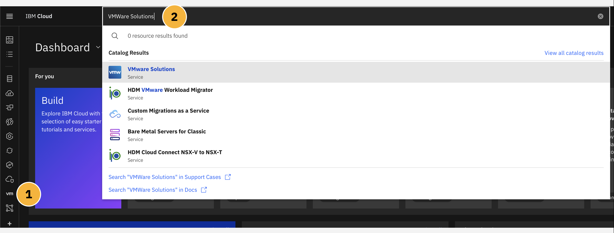
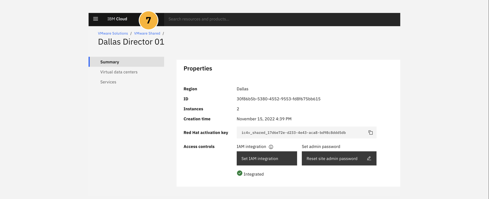
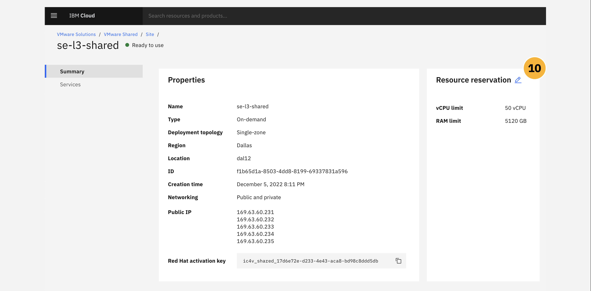
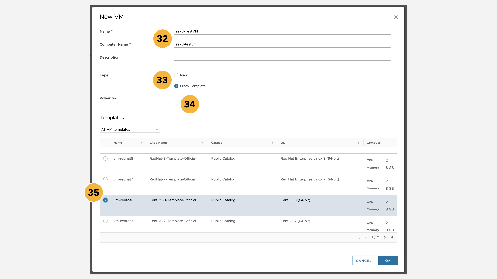
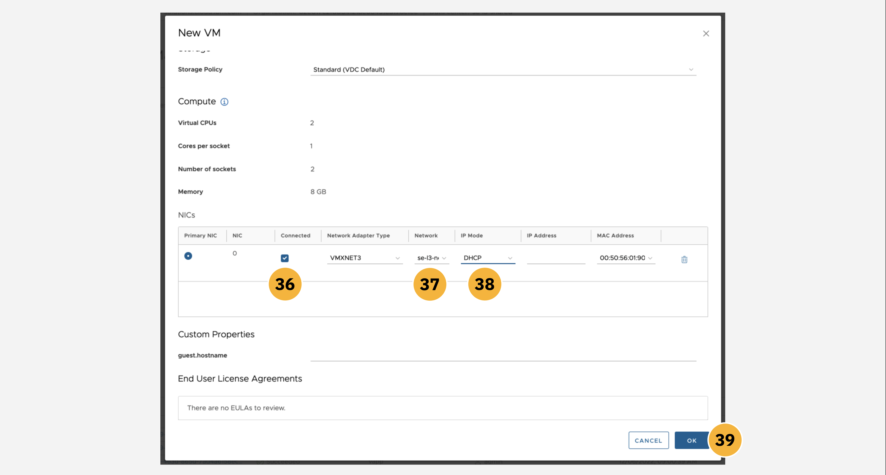
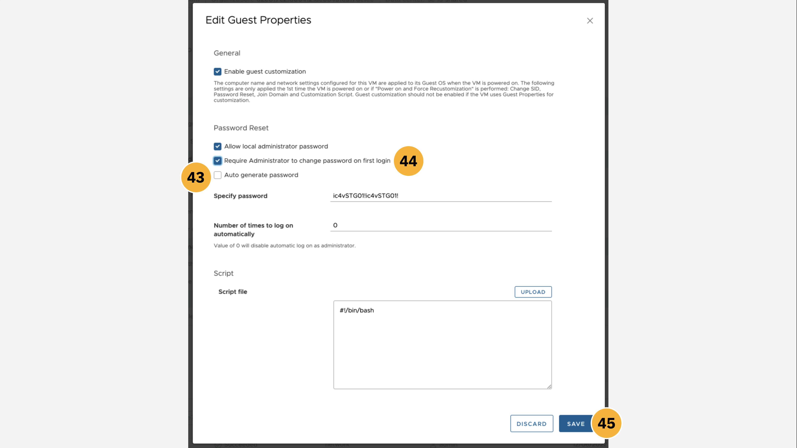
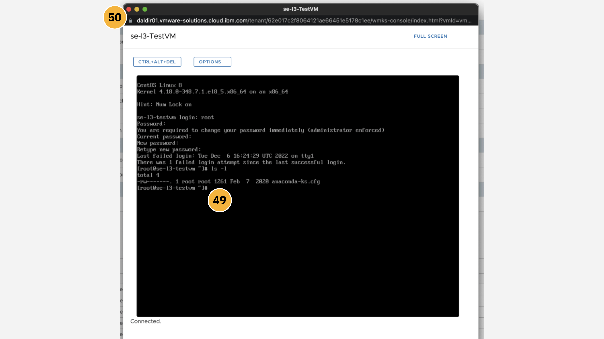

!!! warning "WORK IN PROGRESS"
    Additional text and images to be added.

The following module guides business partners and IBM sellers through the myriad of features and management tools available from within the VMware Shared platform dashboard on IBM Cloud. You will explore various elements of the management panels and tooling, including: data centers, applications, virtual machines, networking, libraries, platform administration, and system monitoring.

VMWare Solutions, including the **Shared** plan and other tiers, are accessible through the <a href="https://cloud.ibm.com/vmware" target="_blank">VMware portal on IBM Cloud</a>.

!!! warning "WARNING"
    If you continue with the following instructions using your _personal_ IBM Cloud account, there is a risk that your account (and credit card associated with that personal account) will be billed for provisioning a VMware Solutions deployment. To avoid any unwanted charges, ensure that your account is switched to ```ITZ-VMWARE``` before continuing.

#
# Accessing the vCloud Director console

1. Ensure that your IBM Cloud account is using the ```ITZ-VMWARE``` account that you were invited to as part of the prerequisite setup for this hands-on material. From the IBM Cloud dashboard, click the **VMware** tab from the left-hand navigation menu, or alternatively search for ```VMware Solutions``` in the search bar.

2. Drill down into the **Resources** tab within the left-hand navigation menu.



3. From the variety of VMware Solutions plans available, click on the **VMware Shared** tab.


4. An instance of VMware Shared should already be set up, having completed the <a href="https://ibm.github.io/SalesEnablement-VMware-L3/Shared/Provisioning/" target="_blank">Provisioning</a> section earlier. Locate the instance— ```Dallas Director 01``` in the example screenshot below, although the naming of your instance may differ —and click the **name** of the instance to pull open a Summary page.


5. The browser will load a Summary panel for the VMware Shared instance, supplying details on access controls for your platform, virtual data centers associated with the deployment, and additional services that can be used in conjunction with the platform. Before you can connect to the VMware Shared instance, you need to set an administrative password for the **vCloud Director console**. Do so by clicking the **Reset site admin password** button as shown.


6. A dialogue window will open, asking you to confirm an administrative password reset for the instance. Confirm the selection and wait for the reset to complete. The **User name** will always be set to ```admin``` by default. The **Password** will be uniquely generated each time a reset is conducted. Click the "eyeball" icon to view the password and the box icon to copy the password to your machine's clipboard. **Record** both of these values to a notepad — you will need to reference these later for connecting to the vCloud Director Console. Click the **Close** button to continue.


7. Back on the Summary page, locate the **vCloud Director console** button near the top-right of the screen. Before resetting the admin password, this button would have been greyed out and inaccessible. With the password reset complete, the button is now active — click it to continue to the console login page.



8. A new tab or window will open, prompting you to log in to the vCloud Director console. Use the ```admin``` and ```password``` fields recorded in **Step 6** to log in to the console.
















