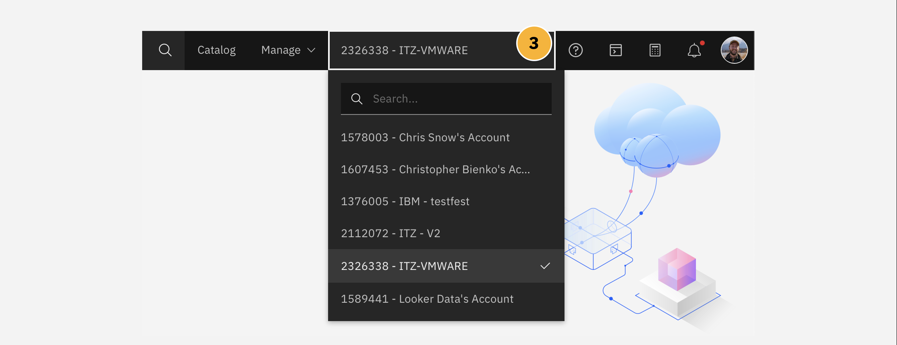

The following module will guide business partners and IBM sellers through the process of provisioning a VMware Solutions Shared plan via the IBM Cloud. Along the way, you will be provide with additional context around sizing and configuration of the offering, the value of these features to end users, and pointers to additional resources should you wish to go deeper.

VMWare Solutions, including the "Shared" plan and other tiers, are accessible through the <a href="https://cloud.ibm.com/vmware" target="_blank">VMware portal on IBM Cloud</a>.

**1.** From the IBM Cloud dashboard, VMware tab from the left-hand navigation menu, or alternatively

**2.** Search for "VMware Solutions" in the search bar.


Next, ensure that your IBM Cloud account is using the ```ITZ-VMWARE``` account that you were invited to as part of the prerequisite setup for this hands-on material.

**3.** You can switch to ```ITZ-VMWARE``` by clicking the drop-down in the top-right corner of the IBM Cloud interface, as shown in the screenshot below.



!!! warning "WARNING"
    If you continue with the following instructions using your _personal_ IBM Cloud account, there is a risk that your account (and credit card associated with that personal account) will be billed for provisioning a VMware Solutions deployment. To avoid any unwanted charges, ensure that your account is switched to ```ITZ-VMWARE``` before continuing.

With your account properly set, you can proceed with configuration and setup of a VMware Solutions Shared plan. There are four platforms currently provided for VMware on IBM Cloud: VMware Shared, VMware as a Service, VMware vSphere, and VMware vCenter Server. For the purposes of this module, you will be configuring and provisioning a VMware Shared platform.

**4.** As shown in the screenshot below, select the VMware Shared tile and click **Create** to continue to the configuration page.


#
# Pricing Plans

!!! tip "ON-DEMAND VS. RESERVED"
    Two tiers of pricing plan are available for any VMware Solutions Shared virtual data center

    environment: ```on-demand``` or ```reserved```.

**On-demand** allocates virtual data center virtual CPU (vCPU) and RAM as needed. The amount of time that the allocation requires will depend upon the global demand (usage) of the virtual data center vCPU and RAM for the region in which it is deployed. Allocations of vCPU and RAM, therefore, are scalable and can be adjusted over time. The price is calculated hourly and it is based on the resource usage in the virtual data center.

**Reserved** pre-allocates the vCPU and RAM virtual data center reservations at deployment time and their availability afterwards is guaranteed; this contrasts sharply with on-demand deployments, where availability is a best-effort guarantee (but not at a certainty — as demand across the infrastructure region in which it is deployed may ebb and flow over time). The price is calculated monthly for the full reservation and it is based on the allocation size of the virtual data center.


#
# Deployment Topology

!!! tip "SINGLE VS. MULTI-ZONE"
    For every deployment of VMware Solutions Shared, there are two Topologies that a client may select

    from: ```single``` or ```multi-zone```.

A **single zone** VMware virtual data center deployment will provision the environment within a single available center (easier to manage, but potentially vulnerable to a single point of failure).

A **multi-zone** VMware virtual data center deployment will deploy across two availability zones in an IBM Cloud multi-zone region, providing failover in the event that a single-zone data center failure occurs.


#
# Networking Types

VMware Solutions Shared on IBM Cloud supports two types of networking: ```Public and Private``` or ```Private Only```." To give the environment the widest range of options, select the ```Public and Private``` option from the configuration panel.

!!! tip "ADVANCED EDGE GATEWAY"
    By default, every virtual data center comes configured with one advanced edge gateway, with five public IP addresses and one private service IP address. The advanced edge gateway is configurable by a customer and can be tailored to their specific needs.

The public network endpoints that are provisioned by default are the five public IP addresses that are displayed in the VMware Solutions Shared virtual data center details page. After the demonstration environment has provisioned, you will be able to go and inspect those for yourself.

A private network endpoint allows a customer's IBM Cloud account devices or resources to connect to their virtual data centers by using the IBM Cloud private network. The Private network endpoint service is available and ready to use in all virtual data centers provisioned through the IBM Cloud. After the private network has been configured, the service allows IBM Cloud account resources to connect to virtual machines (VMs) in a customer's virtual data center over the IBM Cloud private network.

Connections to private network endpoints do not require public internet access. A private network endpoint provides a unique IP address that is accessible to customers without the need for a VPN connection. Private network endpoints support one-way traffic from IBM Cloud account resources to the virtual machine's in a customer's virtual data center.

There are several considerations to be made before creating a private network for VMware Solutions Shared, or any private network connection on IBM Cloud in general. They are:

- If you have an IBM Cloud Direct Link on your account, you must establish a tunnel between the cross-connect router and the customer edge to have access to the virtual data center.

- You can order only one private network endpoint per single-zone virtual data centers.

- For multi-zone virtual data centers, two private network endpoints must be ordered to correspond with each NSX Edge Service Gateway.

- If you want to change the device type of your private network endpoint, you must first delete the existing private network endpoint. Then, create a new private network endpoint with the new device type.

- You can simultaneously make resource updates to your virtual data center while you create or delete a private network endpoint.

!!! tip "ADDITIONAL RESOURCES"
    Dig deeper into how to define and manage private networks within IBM Cloud's online documentation:

    - Viewing a private network endpoint for a virtual data center: <a href="https://cloud.ibm.com/docs/vmwaresolutions?topic=vmwaresolutions-shared_viewing-endpoints" target="_blank">https://cloud.ibm.com/docs/vmwaresolutions?topic=vmwaresolutions-shared_viewing-endpoints</a>

    - Modifying a private network endpoint for a virtual data center: <a href="https://cloud.ibm.com/docs/vmwaresolutions?topic=vmwaresolutions-shared_modifying-endpoints" target="_blank">https://cloud.ibm.com/docs/vmwaresolutions?topic=vmwaresolutions-shared_modifying-endpoints</a>

    - Deleting a private network endpoint from a virtual data center: <a href="https://cloud.ibm.com/docs/vmwaresolutions?topic=vmwaresolutions-shared_deleting-endpoints" target="_blank">https://cloud.ibm.com/docs/vmwaresolutions?topic=vmwaresolutions-shared_deleting-endpoints</a>

    - Creating a private network endpoint: <a href="https://cloud.ibm.com/docs/vmwaresolutions?topic=vmwaresolutions-shared_creating-endpoints" target="_blank">https://cloud.ibm.com/docs/vmwaresolutions?topic=vmwaresolutions-shared_creating-endpoints</a>


#
# Virtual Data Center Capacity

These values essentially determine the compute processing capacity that is allocated to your virtual data center. These are measured in vCPU increments. Each vCPU increment represents a single 2.0 GHz core.  Compute memory, or "RAM limit" as it is described on the IBM Cloud portal, is allocated in GB increments. RAM limits identify the maximum random access memory for each virtual data center.

The limit you place on the maximum vCPU values determines the total number of processing units available for each virtual data center. Similarly, the RAM limit sets the maximum amount of memory available. You can adjust either of these values after you provision the virtual data center — giving customers the ability to scale and grow their virtual date center over time.

The least amount of vCPU that can be provisioned for any data center is 1 vCPU; RAM is likewise limited to a minimum of 1 GB. Set both parameters to 1 so that the demonstration environment is as economically-priced as possible. Obviously, in the case of a real-world demonstration environment (or a production environment), you will want to size these appropriately to the anticipated workloads that the virtual server will be subject to.


#
# Storage

Storage policy availability can vary by region and deployment topology. To inspect further details on the storage options available for any VMware Solutions Shared configuration, click the "About" tab at the top of the IBM Cloud catalog page.

When you create or deploy vApps or VMs, you can select either an unencrypted or encrypted storage policy. Each option has six different tiers of storage available, depending on the storage performance required, with each option carrying a maximum throughput of IOPS (input-output operations per second) per gigabyte.

Encryption-enabled storage policies are available to all virtual data centers. Encryption protects not only the VMs but also VM disks and other files. Administrators can encrypt VMs and disks by associating the VM or disk with a storage policy that has the VM encryption capability. For more information about the VM encryption limitations for VMware Cloud Director 10.3, see <a href="https://docs.vmware.com/en/VMware-Cloud-Director/10.3/VMware-Cloud-Director-Service-Provider-Admin-Portal-Guide/GUID-80F58C1D-A97E-43FE-8E41-E9242A1D2332.html" target="_blank">Enabling VM encryption on storage policies of an Organization virtual data center</a>.


#
# Pre-Installed Services

There are three services pre-installed with every deployment of VMware Solutions Shared on IBM Cloud. While they are ready for consumption and use at any time, they are not free to use — if a customer wishes to make use of these services, they must activate a license and incur the costs associated with that add-on service. No additional charges will be leveed against customers who choose to not use the service.

The pre-installed services include:

- **Veeam Availability Suite**: Veeam enables secure backups to IBM Cloud for VMware Solutions Shared workloads. It also packages capabilities for meeting recovery objectives, cloud-based disaster recovery backups, as well as monitoring and reporting capabilities.

- **Veeam Cloud Connect Replication**: Extends on-premises Veeam environments to IBM Cloud, providing a secure and resilient disaster recovery environment.

- **Zerto**: Replicates VMs between data centers in the public cloud, or between the public cloud and on-premises data centers.


#
# After Placing An Order

The deployment of the resources starts automatically and you receive confirmation that the order is being processed. You can check the deployment status, including any issues that might require your attention, by viewing the Virtual Data Center Status.

When the resources are successfully deployed, the components that are described within the <a href="https://cloud.ibm.com/docs/vmwaresolutions?topic=vmwaresolutions-shared_overview#shared_overview-specs" target="_blank">technical specifications documentation for VMware Solutions Shared</a> will be installed within your VMware virtual platform environment.

When the resources are ready to use, the status is changed to **Ready** to use.


!!! warning "Work in Progress"
    More to be written and screenshots to be applied.
