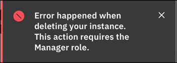
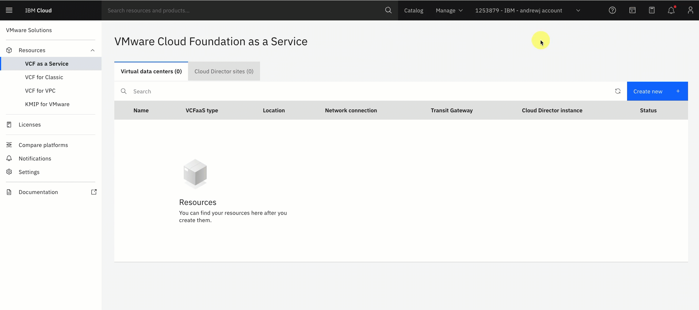
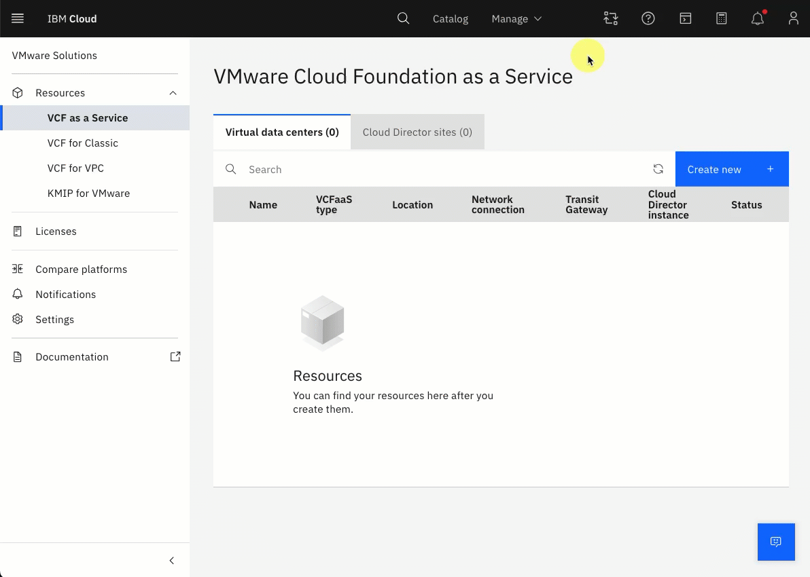
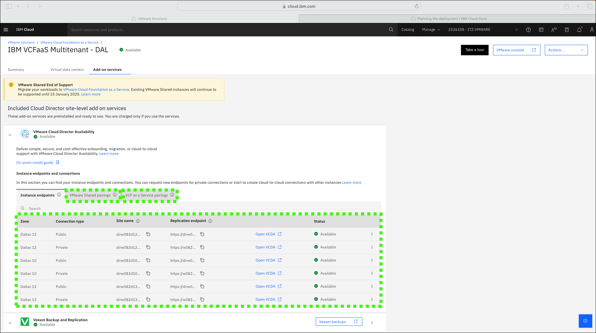

In VMware Cloud Foundation (VCF) as a Service, a **Cloud Director site** is where the physical resources for VCF are managed. 

In VCF as a Service **single-tenant**, the client would be responsible for specifying the compute and storage infrastructure for their site. Using the IBM Cloud portal, the client might grow and shrink their site as they want.

In VCF as a Service **multitenant**, IBM manages most aspects of the **Cloud Director site**. Each site will host Virtual Data Centers (VDCs) for many different clients. The only actions clients can perform on the IBM managed site are:

- create new VDCs
- add and remove **Add-on services**

!!! Important "About the IBM Technology Zone (ITZ) environment"

    The steps that follow are specific to the ITZ environment reserved as part of the {{learningplan.name}} learning plan. If you don't already have an active reservation, you can create one <a href="{{itz.environment}}" target="_blank">here</a>. Follow the directions specified in the "Reserve the environment" activity in the learning plan.

    Remember, in the ITZ environment you will **NOT** have permission to create, delete, or modify resources. You will be utilizing pre-provisioned and pre-configured resources that are shared by all users of the learning plan.

    The steps outlined go up to the point of creating, deleting, or modifying a resource and then instruct you to cancel the pending action. This approach is common for client demonstrations as some events take longer than you would want to wait during a live demonstration. Explain to the client what would occur if the action had been completed (for example, "the resource would then be deleted.").

    If an attempt is made to complete the action in the ITZ environment an error message would be shown like:

    

1. Click the following link to open a browser to the IBM Cloud portal.

    <a href="https://cloud.ibm.com/vmware/resources/vdc" target="_blank">IBM Cloud portal - VCF as a Service</a>

2. If not already in the {{itz.account}} account, switch to the {{itz.account}} IBM Cloud account.

    Depending on the size of the browser window, the switch account menu varies as seen in these two animated images.

    

    

3. Click the **Cloud Director sites** tab.

    

4. Expand the **{{itz.VCFaaSmt.siteName}}** entry.

    

5. Examine the information displayed for the site, and then click the **{{itz.VCFaaSmt.siteName}}** link.

    

6. Examine the information displayed for the site, and then click the **Virtual data centers** tab.

    Note, the number of VDCs only shows the number of VDCs owned by this IBM Cloud account and not the total number of VDCs in the site that is managed by IBM.

    

7. Examine the VDC information displayed, and then click the **Add-on services** tab.

    Note the ability to create a new VDC. Clicking this button would open the dialog that was seen earlier when provisioning a new VCF as a Service multitenant instance.

    

8. Examine the **Add-on services** page.

    In the ITZ environment for this learning plan, all available **Add-on services** have already been installed. VMware Cloud Director Availability (VCDA) was installed when the VCD instance was initially provisioned. Veeam Backup and Replication was installed after the VCD instance was provisioned. Before Veeam was installed, an **Add** appeared on the page where Veeam was selected. 

    

9. Expand the **VMware Cloud Director Availability (VCDA)** entry.

    

10. Examine the information and tabs available for VCDA.

    !!! Important "About the IBM Technology Zone (ITZ) environment"

        At this time, administrative access to the **Add-on services** for this instance is not provided. The IBM Cloud Identity Access Management (IAM) controls do not provide sufficient isolation control for these services in a shared environment like the one used by this learning plan. Users will **NOT** be able to open the VCDA console.

    Details about the instance endpoints and connections are displayed. Learn more about this topic <a href="https://cloud.ibm.com/docs/vmware-service?topic=vmware-service-vcda-adding-deleting-private-ep" target="_blank">here</a>.

    - **Instance endpoints** - Public instance endpoints are provided by IBM. Clients can request new endpoints for private connections. Extra charges apply when new private endpoints are added.
    
    - **VMware Shared pairings** - Create and manage cloud-to-cloud connections between the instance and VMware Shared instances. **VMware Shared has been withdrawn and will reach end of support on January 15, 2025.**

    - **VCF as a Service pairings** - Create cloud-to-cloud connections between the instance and another single-tenant or multitenant VCF as a Service instance.

    

That concludes the overview of managing a VCF as a Service multitenant site.