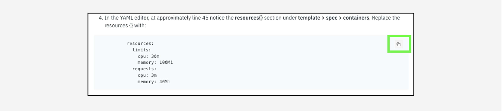
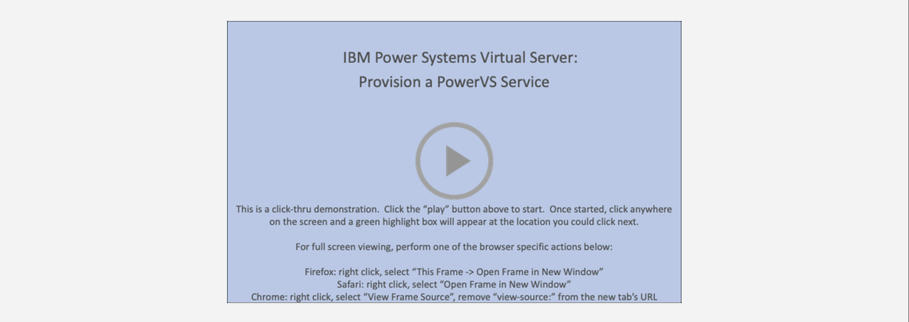

!!! tip "WAYS TO WATCH"
    In addition to the embedded video, IBMers and Business Partners can also <a href="https://ibm.seismic.com/Link/Content/DCFGW2RT6jVGm82VTDMJ6TdDJC4V" target="_blank">download the recording from Seismic</a>.

Welcome to the **IBM Cloud for VMware Solutions - Level 3** course and demonstration guide! The goal is to provide IBM and Business Partner Sales and Technical Sales with the knowledge and tools to perform click-thru demonstrations of **VMware Shared** and **VMware Dedicated** plans via the IBM Cloud.

!!! warning "LIMITED ACCESS"
    For this Level 3 course, full access to a live IBM Technology Zone or IBM Cloud account is **NOT** provided, due to the potentially high costs this may incur and the challenges with providing a multi-tenant VMware environment across a global audience of IBMers and business partners. Instead, click-thru demonstrations and recorded walkthroughs have been provided to simulate a live VMware Solutions instance.

    Participants can leverage the click-thru demos in front of clients as part of a "live" demonstration; similarly, IBM Sellers and Technical Sellers can use the demos for recording a Stand & Deliver presentation for their Level 3 accreditation.

Currently, there are four offerings in the IBM Cloud for VMware Solutions portfolio: ```VMware Shared```, ```VMware as a Service```, ```VMware vSphere```, and ```VMware vCenter Server```. This Level 3 learning plan on only the ```VMware Shared``` and ```VMware Dedicated``` offerings. This course is not intended to serve as a deep dive into VMware-specific topics, rather the focus is on the ```on IBM Cloud``` aspects of the offerings. Numerous links and pointers to additional content around VMware-specific features are included in each of the modules of this course.

Most modules are accompanied by recordings and narrated instructions, delivered by your team of authors. Be sure to watch these for a visual demonstration of how to perform the hands-on lab components. In particular, it is strongly recommended that IBM Sellers and Technical Sellers watch these recordings — they will be useful for you as you go about creating and recording your own Stand & Deliver presentations for Level 3 accreditation.

!!! tip "ACCREDITATION"
    To receive Level 3 accreditation, IBMers and Business Partners must demonstrate mastery of the skills learned throughout the various modules of these hands-on labs and coursework. Level 3 accreditation requirements— and the way participants will be evaluated before receiving accreditation —differs depending on job role.

**Business Partners** must pass an accreditation quiz after completing the hands-on portion of the course. The quiz consists of multiple choice questions, with four possible responses (and only one correct answer) for each question.

**IBM Sales and Tech Sales** must develop and record a Stand & Deliver presentation. This video is intended to simulate your delivery of a “live” demo in front of a client — on camera. IBMers will have flexibility in defining a hypothetical client, the pain points that customer has, and the goals they aspire to achieve. The recording will then cover the seller’s hands-on demonstration and pitch to the client of the value of the IBM solution using the environments and techniques of this lab.

Specific criteria that must be demonstrated as part of the Stand & Deliver recordings is provided within the documentation that accompanies the Level 3 course. Before jumping into the next module, please read the guidance below. Your comprehension of the information outlined below will save you time while completing the lab work.

!!! tip "FIND HELP"
    If at any point during the hands-on material you need help from the team of authors and other IBM experts, please connect with us via the #cloud-platform-demo-feedback Slack channel. Any comments or suggestions are also welcome in this channel.

#
# Navigating the Lab Guide
-----------------------------

The Level 3 demonstration guide is organized into two chapters, covering the ```VMware Shared``` and ```VMware Dedicated``` offerings of the **IBM Cloud for VMware Solutions** portfolio. Both chapters contain modules that provide an *Introduction* to offering, steps to *Provision* a deployment, and explore how clients *Manage* their instance through the IBM Cloud portal and the respective VMware tools.

!!! warning "WARNING"
    The agile nature of cloud means that the interface and layout of the IBM Cloud Portal, as well as the IBM Cloud for VMware Solutions offering, will change on a regular basis. Screenshots and videos captured within this documentation may not always reflect the latest versions available from IBM Cloud — although the IBM Technology Sales Enablement team strives to update these assets on a regular basis.

In some images, the following styles of highlighting are utilized:

- **Action highlight box**: Illustrates where to click, enter, or select an item.


- **Path/explore highlight box**: Illustrates one of two things: the path to follow to get to a specific location in the user interface; or areas to explore.


- **Copy to clipboard box**: The text is copied to the clipboard. Click the copy icon (highlighted below) and then paste using the operating systems paste function; for example, entering ```Ctrl+v```, ```Cmd+v```, or right-click and select ```Paste```.


- **Click-thru interactive demonstrations**: Links to click-thru demonstrations will open in a new browser window or tab with a screen similar to the image below. Click the ```(>)``` icon to get started and follow the steps outlined within this L3 demonstration guide. If unsure of where to click to proceed, click anywhere on the screen and a highlight box will appear indicating where to click next.



#
# Acronyms
-----------------------------

The following acronyms and short-form terminology are used throughout the guide:
```
Application programming interfaces (APIs)
Classless inter-domain routing (CIDR)
Control (ctrl) - The control key on keyboard
Command (cmd) - The command key on keyboard
Disaster Recovery (DR)
Gigabyte (GB)
High Availability (HA)
IBM Technology Zone (TechZone)
Infrastructure as a Service (IaaS)
Input/output operations per second (IOPs)
Internet Protocol (IP)
Operating System (OS)
Random access memory (RAM)
Reliability, Availability, and Serviceability (RAS)
Secure Socket Shell (SSH)
User identification (ID)
Virtual Machine (VM)
```
